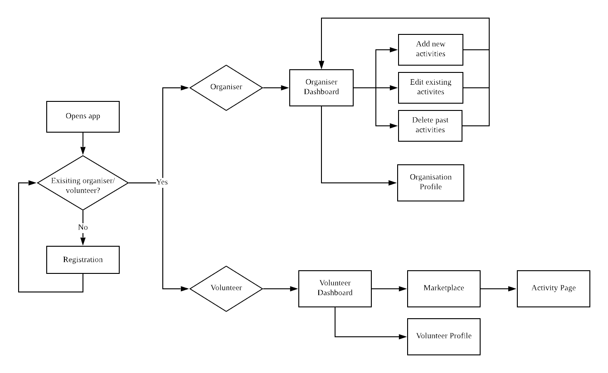
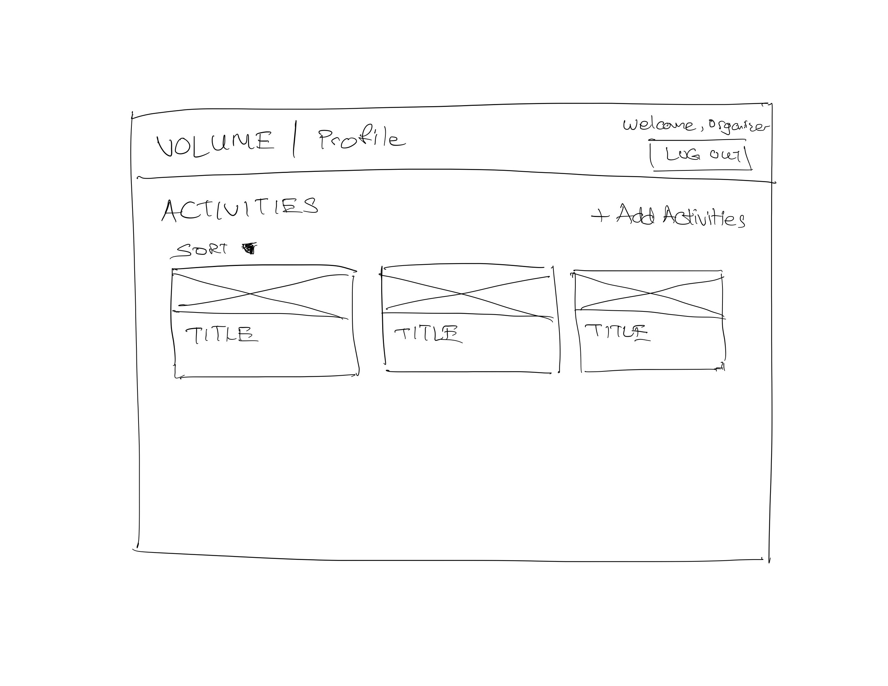
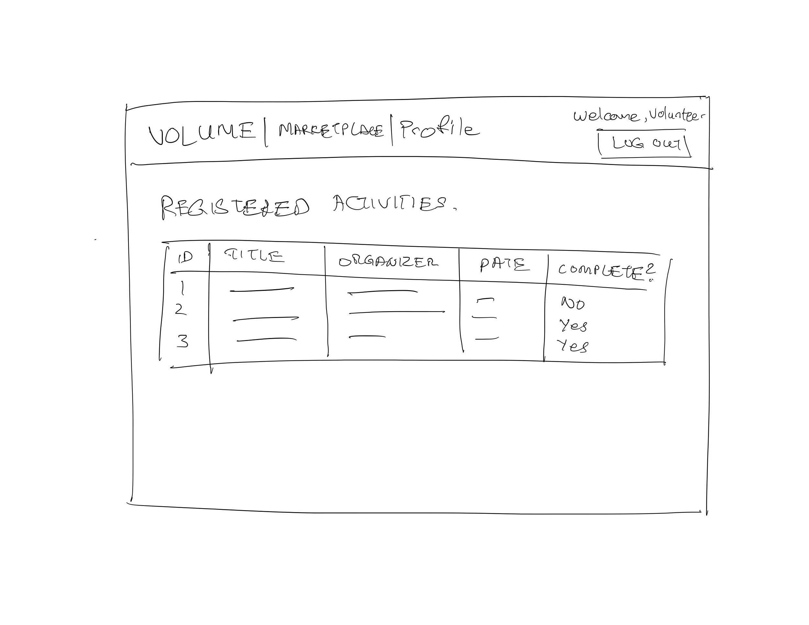
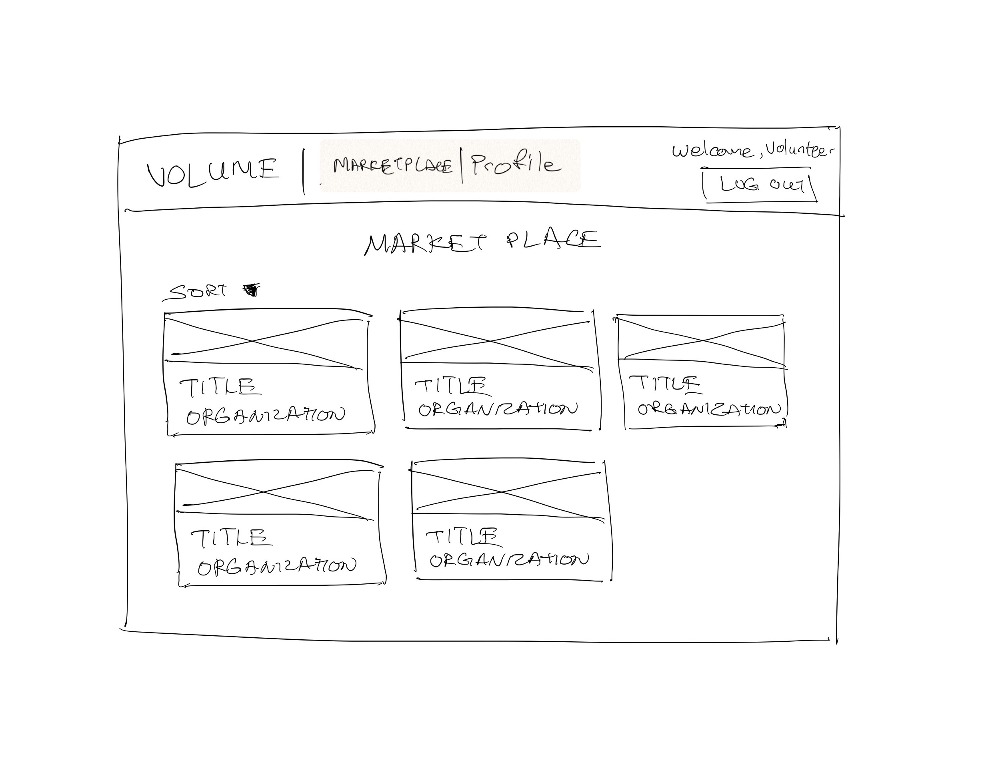
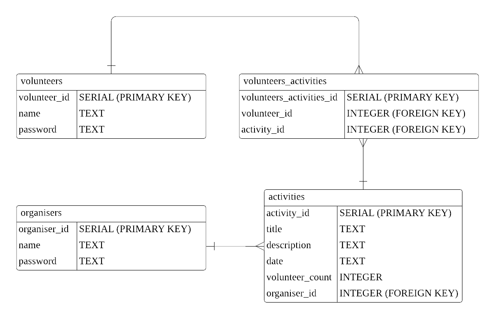

# Volume - Volunteer Management Application

## Background

Voluntary welfare organisations (VWOs) are regularly seeking volunteers to support their social activities. Particularly in times of crises, VWOs need to reach out quickly to members of public for suitable volunteers. Similarly, members of public are also looking out for opportunities to contribute to causes that they are passionate about.

## Problem

It is challenging for VWOs to find volunteers who are a right fit to meet their needs. Sourcing for volunteers via messages to general public also have a low efficacy.

Similarly, members of public who are eager to volunteer often find it difficult to navigate through various individual VWO's website to seek the right volunteering opportunities.

## Solution

An app that will serve as a platform for both VWOs and members of public who are interested to volunteer to better connect with each other.

## User Stories

1. As an organiser, I want to be able to post information on upcoming social activities for so that interested volunteers can sign up.

2. As an organiser, I want to be able to view the profile of volunteers who have signed up, so that I can assess if they are a good fit (e.g. possess relevant skills) for the social activity.

3. As an interested volunteer, I want to be able to view various volunteering opportunities on a common page, so that I can sign up for them more easily.

4. As an interested volunteer, I want to be able to view the status of all my volunteering activities that I have applied for, so that I can keep track of upcoming/ past activities.

5. As an interested volunteer, I want to be able to communicate with VWOs, so that I can clarify any questions I have with them on the volunteering activities.

## User Flow

## Wireframing
### Organisers

### Volunteers

## ERD

